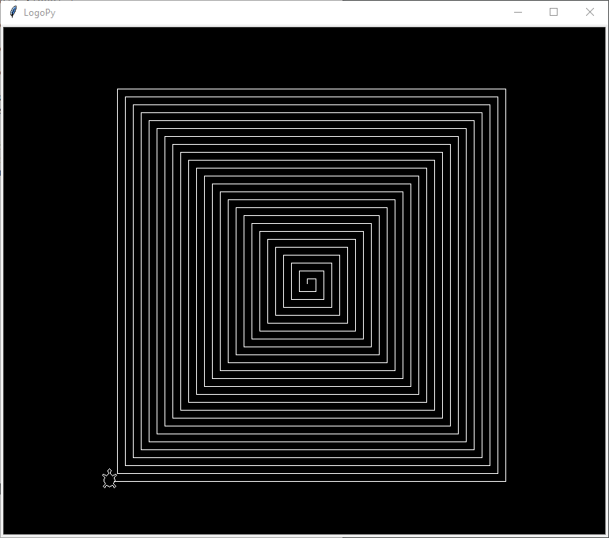

# **DOKUMENTACJA**

## **1. Ekspresowy tutorial żółwiego języka**
---
## Typy
```
# string - ciąg znaków zaczynający się "
print "Hello_World 

# integer
make "m 123

# float
make "x 1.5
make "y .99

# bool
if true [print "prawda]
while false [print "nigdy]
```

## Zmienne
```
# deklaracja (nazwa to string)
make "zmienna 1+2

# odwołanie (dwukropek nazwa)
make "wieksza_zmienna :zmienna*2          # wieksza_zmienna = 6
make "wieksza_zmienna :wieksza_zmienna*2  # wieksza_zmienna = 12
```

## Arytmetyka
```
print 3+2             # 5
print 9-2*3.0         # 3.0
print (8-2)/:zmienna  # 2
print -2^4            # -16
print (-2)^4          # 16
print :m^:m           # 15129
```

## Warunki logiczne
```
if 2 = 2 [print "to_prawda]
if 2 != 1+1 [print "to_nieprawda]
ifelse :m>0 [print "to_wypisze] [print "tego_nie_wypisze]
do [print "wypisze_raz] while 2 >= :wieksza_zmienna 
```

## Dyrektywy
```
# if
if :x>:y [print "wypisze]

# ifelse
ifelse true [print "gdy_prawda] [print "gdy_falsz]

# while
while :m>0 [make "m :m-1 print "m]
until true [print "nieskonczona_petla]

# do while
do [print "raz] while false
do [print "raz] until false

# repeat
repeat 4 [fd 100 rt 90]
```

## Funkcje
```
# definicja 
to "nazwa_funkcji [lista_parametrów] body end

# funkcja rysująca prostokat o danych bokach
to "prostokat [:a,:b]
    repeat 2 [
        fd :a rt 90
        fd :b rt 90
    ]
end

# funkcja bez parametrów
to "czesc []
    print "czesc
end


# wywoływanie funkcji
nazwa_funkcji[wartości_parametrów]

prostokat[10,10*2]
czesc[]

```

## Ruch żółwia i rysowanie
1. Komendy bezargumentowe
```
home                    - powrót do punktu (0,0)
pu, penup               - podniesienie pisaka
pd, pendown             - opuszczenie pisaka
st, showturtle          - pokaż żółwia
ht, hideturtle          - ukryj żółwia
clean                   - wyczyść tło (nie zmienia położenia żółwia)
cs, clearscreen, reset  - wyczyść tło i zresteuj żółwia
```
2. Komendy jednoargumentowe
```
a. argument to wartość

fd, forward                  - do przodu
bk, backward                 - do tyłu
rt, right                    - obrót w prawo (w stopniach)
lt, left                     - obrót w lewo (w stopniach)
seth, setheading             - ustaw skierowanie (w stopniach)
setx, sety                   - ustaw położenie w osi X lub Y
setpensize, petwidth, setpw  - ustaw grubość pisaka

b.  argument to string

setpc, setpencolor, setcolor  - ustaw kolor pisaka
setbgcolor                    - ustaw kolor tła

przykłady:

fd 100
rt :kat
forward :x*100
setpc "black
setbgcolor "#ff0000
```
3. Komendy dwuargumentowe
```
setpos, setxy  - ustaw pozycję XY

np.:
setxy [-100,:x*2]
```
4. Prędkość
```
użycie: speed wartość

tryby:
 - wartość < 0 -- pominięcie rysowania każdego kroku, najszybsze
 - wartość = 0 -- najszybsze rysowanie z widocznymi krokami
 - wartość z przedziału (1,+inf) -- coraz wolniejszy ruch żółwia
```
---
## **2. Przykłady + wizualizacje**
---
## Trójkąt Sierpińskiego
```
to triangle [:side, :level]
    if :level!=0 [
        repeat 3 [
            triangle[:side/2, :level-1] fd :side lt 120
        ]
    ]
end 

speed -1
setpos[240,-220] seth -30 clean 
triangle[500,7]
```

## Fern
```
to fern [:size, :sign]
    if :size >= 1 [
        fd :size 
        rt 70*:sign 
        fern [0.5*:size, -:sign] 
        lt 70*:sign
        fd :size
        lt 70*:sign 
        fern [0.5*:size, :sign] 
        rt 70*:sign
        rt 7*:sign 
        fern [:size-1, :sign] 
        lt 7*:sign
        bk :size*2
    ]
end

speed -1

cs setpos[-190,-220] clean ht 
fern[30,1.2]

cs setpos[-100,-50] clean ht 
fern[40,5]
```

## Krzywa Kocha
```
to koch[:side,:level]
    ifelse :level=0 
    [fd :side]
    [
        koch[:side/3, :level-1] lt 60
        koch[:side/3, :level-1] rt 120
        koch[:side/3, :level-1] lt 60
        koch[:side/3, :level-1]
    ]
end
sety -300 speed 0 clean
koch[600,4]

```

## Logo Logo :)
```
to n_eck [:ne, :sz] 
    repeat :ne [rt 360 / :ne fd :sz] 
end 
to mn_eck [:ne, :sz] 
    repeat :ne [
        rt 360/:ne 
        n_eck[:ne, :sz]
    ] 
end

speed 0 
cs ht setbgcolor "black setpc "white
mn_eck[36,20] 
st
```

## Wielokąt foremny
```
to foremny[:n, :a]
    repeat :n [
        fd :a 
        rt 180-180/:n*(:n-2)
    ]
end

cs 
foremny[9, 100]
```

## Spirala
```
to spiral[] 
    make "n 1 
    while :n<500 [
        make "n :n+5 
        fd :n 
        rt 90
    ] 
end
spiral[]
```
